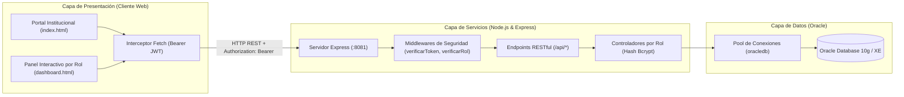

# SIGPA — Sistema Integral de Gestión de Prácticas Académicas 🎓

<div align="center">

[English](README.md) | **Español**

</div>

[](https://nodejs.org/)
[](https://expressjs.com/)
[](https://www.oracle.com/database/)
[](#-arquitectura-de-seguridad-y-control-de-acceso)
[](https://developer.mozilla.org/)
[](https://www.udi.edu.co/)

**SIGPA** (*Sistema Integral de Gestión de Prácticas Académicas*) es una aplicación web full-stack de nivel empresarial desarrollada para la **Universidad de Investigación y Desarrollo (UDI)**. Centraliza, automatiza y monitorea de punta a punta el ciclo de vida de las prácticas pedagógicas y formativas de los estudiantes.

La plataforma conecta en tiempo real a Directores de Programa, Tutores Académicos, Asesores de Centro de Práctica (In Situ) y Estudiantes Practicantes, garantizando trazabilidad, validación estructurada de bitácoras, seguridad criptográfica en credenciales, autorización basada en roles (RBAC) y cumplimiento normativo institucional.

---

## 🏛️ Arquitectura del Sistema

El sistema implementa una arquitectura desacoplada en tres capas que garantiza separación de responsabilidades, alta mantenibilidad y seguridad robusta:



---

## 👥 Módulos y Control de Acceso Basado en Roles (RBAC)

| Rol | Alcance y Responsabilidades | Protección de Rutas |
| :--- | :--- | :--- |
| **Director de Programa** | Administración general, gestión de convenios con instituciones, configuración de plazas, provisión de cuentas y métricas macro (KPIs). | `/api/director/*` (`DIRECTOR`) |
| **Tutor Académico** | Supervisión pedagógica; validación de horas acumuladas, seguimiento semanal por visitas y emisión de calificaciones formativas. | `/api/tutor/*` (`TUTOR`, `COORDINADOR`) |
| **Asesor In Situ** | Supervisor en el centro de práctica; verifica la asistencia física en aula y avala las bitácoras presentadas por el practicante. | `/api/asesor/*` (`ASESOR`) |
| **Estudiante Practicante**| Practicante activo; consulta asignaciones, registra planeaciones por momentos pedagógicos con evidencias digitales y monitorea su semáforo de horas. | `/api/estudiante/*` (`ESTUDIANTE`) |

---

## 🔒 Arquitectura de Seguridad y Control de Acceso

La plataforma incorpora los estándares de seguridad exigidos en aplicaciones web profesionales:

1. **Cifrado Unidireccional de Contraseñas (Bcrypt):**
   * Las contraseñas en la tabla `USUARIO` se procesan con `bcryptjs` utilizando un factor de costo de 10 (`$2b$10$...`), generando hashes seguros de 60 caracteres.
   * Ninguna contraseña se almacena ni se evalúa en texto plano mediante cláusulas `WHERE` en SQL.
   * **Auto-Migración Transparente:** Las cuentas de prueba heredadas en texto plano se autentican y actualizan automáticamente a un hash bcrypt en su primer inicio de sesión.
   * La columna `CONTRASENA` en Oracle fue ampliada a `VARCHAR2(255)` para garantizar compatibilidad sin riesgo de truncamiento.

2. **Tokens de Sesión sin Estado (JSON Web Tokens - JWT):**
   * Tras una autenticación exitosa, el servidor firma criptográficamente un token JWT con la identidad del usuario (`id`, `nombre`, `email`, `rol`).
   * Tiempo de vida configurable (`JWT_EXPIRES_IN=8h`) firmado mediante clave privada (`JWT_SECRET`).
   * Almacenamiento seguro en el cliente en `sessionStorage` y `localStorage`.

3. **Middlewares de Autorización por Rol:**
   * `verificarToken`: Valida la presencia e integridad del encabezado `Authorization: Bearer <token>`. Retorna `401 Unauthorized` si falta o ha expirado.
   * `verificarRol(roles)`: Inspecciona los privilegios requeridos por cada endpoint, retornando `403 Forbidden` ante intentos de acceso no autorizados.

4. **Interceptor HTTP en el Frontend:**
   * Un interceptor transparente sobre `window.fetch` inyecta automáticamente el encabezado `Authorization: Bearer <token>` en todas las peticiones a la API.
   * Atrapa respuestas `401 Unauthorized` para purgar la sesión vencida y redirigir limpiamente a `index.html?session_expired=1`.

---

## 📁 Estructura del Repositorio

```text
sigpa_app/
├── backend-node/           # API REST construida con Node.js y Express
│   ├── src/
│   │   ├── config/         # Pool de conexiones oracledb y script DDL automatizado
│   │   ├── controllers/    # Lógica de negocio segregada por rol (Bcrypt & JWT)
│   │   ├── middlewares/    # verificarToken, verificarRol y manejador central de errores
│   │   ├── routes/         # Rutas protegidas de la API (/api/director, /api/estudiante, etc.)
│   │   └── app.js          # Punto de entrada Express con política Fail-Fast para Oracle
│   ├── .env.example        # Plantilla de variables de entorno (DB y JWT_SECRET)
│   ├── test_api.js         # Pruebas de integración con base de datos y RBAC
│   ├── test_auth_unit.js   # Pruebas unitarias aisladas de Bcrypt y middlewares JWT
│   └── package.json        # Dependencias (oracledb, bcryptjs, jsonwebtoken, express, cors)
│
├── frontend/               # Aplicación cliente web responsiva
│   ├── css/
│   │   └── style.css       # Hoja de estilos moderna con identidad institucional UDI
│   ├── js/
│   │   └── app.js          # Lógica cliente, interceptor fetch, gráficos Chart.js y estado
│   ├── index.html          # Portal institucional de aterrizaje y login multirrol
│   └── dashboard.html      # Panel dinámico adaptado por rol con protección de sesión
│
└── database/
    └── schema.sql          # DDL completo de Oracle: tablas (VARCHAR2(255) contraseñas), semillas y restricciones
```

---

## 🚀 Puesta en Marcha (Instalación Local)

### 1. Requisitos Previos
* **Node.js** v18 o superior instalado.
* Instancia activa de **Oracle Database** (10g, 11g, 19c, o Express Edition XE).

### 2. Configuración del Backend
Accede al directorio del backend e instala las dependencias:

```bash
cd backend-node
npm install
```

Crea tu archivo de variables de entorno a partir de la plantilla:
```bash
cp .env.example .env
```

Configura tus credenciales de Oracle y la clave secreta de JWT en `.env`:
```env
PORT=8081
DB_USER=tu_usuario_oracle
DB_PASSWORD=tu_contrasena_oracle
DB_CONNECT_STRING=localhost:1521/XE

# Seguridad y Autenticación JWT
JWT_SECRET=tu_clave_secreta_jwt_para_firmar_tokens
JWT_EXPIRES_IN=8h
```

### 3. Inicialización de la Base de Datos
Ejecuta el script automatizado para verificar la conectividad y sincronizar las tablas DDL en Oracle:
```bash
npm run setup-db
```

### 4. Pruebas Unitarias de Seguridad
Verifica la integridad del hashing de contraseñas, firma de tokens y middlewares de rol:
```bash
node test_auth_unit.js
```

### 5. Iniciar la Aplicación
Arranca el servidor en modo desarrollo con recarga en caliente:
```bash
npm run dev
```

* **Aplicación Web:** Abre `http://localhost:8081` en tu navegador.
* **Diagnóstico de Base de Datos:** `http://localhost:8081/api/test-db`

---

## 🛡️ Aspectos Destacados de Ingeniería y Buenas Prácticas
* **Integridad Criptográfica:** Hashing estándar (`bcryptjs`) que protege las credenciales incluso frente a fugas de copias de seguridad de la base de datos.
* **Autorización Stateless (JWT):** Gestión de sesiones escalable sin sobrecargar la memoria del servidor.
* **Pool de Conexiones:** Acceso eficiente y concurrente a Oracle mediante `oracledb.createPool`.
* **Arquitectura Fail-Fast:** El servidor valida estrictamente la conexión a Oracle antes de comenzar a escuchar peticiones HTTP.
* **Separación de Responsabilidades (SoC):** Aislamiento estricto entre persistencia de datos, reglas de negocio, middlewares de autorización y vistas cliente.
* **Entorno Protegido:** Credenciales sensibles y firmas criptográficas aisladas en `.env` (excluido de Git).

---

## 👨‍💻 Autores y Reconocimientos
Proyecto Integrador de Semestre desarrollado para la **Universidad de Investigación y Desarrollo (UDI)**:
* **Andrés Sequeda** ([@FlipSv](https://github.com/FlipSv))
* **Santiago Acevedo**
