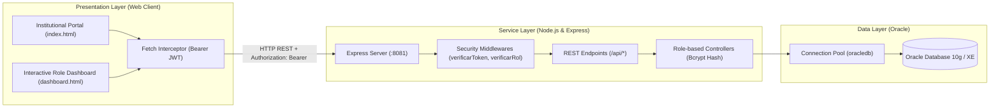

# SIGPA — Academic Internship Management System 🎓

<div align="center">

**English** | [Español](README.es.md)

</div>

[](https://nodejs.org/)
[](https://expressjs.com/)
[](https://www.oracle.com/database/)
[](#-security--access-control-architecture)
[](https://developer.mozilla.org/)
[](https://www.udi.edu.co/)

**SIGPA** (*Sistema Integral de Gestión de Prácticas Académicas*) is an enterprise-grade full-stack web application developed for **Universidad de Investigación y Desarrollo (UDI)**. It centralizes, automates, and monitors the entire lifecycle of student academic internships and pre-professional practicums.

The platform connects Program Directors, Academic Tutors, Institutional On-Site Advisors, and Students in real time—ensuring complete auditability, logbook validation, cryptographic password security, role-based authorization, and institutional compliance.

---

## 🏛️ System Architecture

The platform follows a decoupled, three-tier architecture ensuring separation of concerns, scalability, and robust security:



---

## 👥 Modules & Role-Based Access Control (RBAC)

| Role | Scope & Responsibilities | Route Protection |
| :--- | :--- | :--- |
| **Program Director** | General administration, institutional partnerships, practicum placement, account provisioning, and macro-level KPI reporting. | `/api/director/*` (`DIRECTOR`) |
| **Academic Tutor** | Pedagogical supervisor; validates accumulated student hours, oversees weekly progress, and submits official grading. | `/api/tutor/*` (`TUTOR`, `COORDINADOR`) |
| **On-Site Advisor** | In-situ supervisor at the host institution; verifies physical attendance and provides endorsement for student logbooks. | `/api/asesor/*` (`ASESOR`) |
| **Student Intern** | Practicum candidate; consults assigned placements, submits modular logbooks with digital evidence, and tracks approved hours. | `/api/estudiante/*` (`ESTUDIANTE`) |

---

## 🔒 Security & Access Control Architecture

The platform implements modern application security standards:

1. **One-Way Cryptographic Password Hashing (Bcrypt):**
   * Passwords in the `USUARIO` table are hashed using `bcryptjs` with a cost factor of 10 (`$2b$10$...`).
   * Plain-text passwords are never persisted or evaluated via raw SQL `WHERE` clauses.
   * **Transparent Auto-Migration:** Legacy test accounts in plain text are authenticated and automatically upgraded in Oracle to bcrypt hashes upon first login.
   * Oracle DDL column width expanded to `VARCHAR2(255)` to safely accommodate 60-character hashes.

2. **Stateless Session Tokens (JSON Web Tokens - JWT):**
   * Upon successful authentication, the server signs a JWT containing the user identity (`id`, `nombre`, `email`, `rol`).
   * Configurable token lifespan (`JWT_EXPIRES_IN=8h`) and cryptographically signed with `JWT_SECRET`.
   * Stored securely in client-side storage (`sessionStorage` / `localStorage`).

3. **Role-Based Authorization Middlewares:**
   * `verificarToken`: Validates incoming `Authorization: Bearer <token>` headers, returning `401 Unauthorized` on missing or expired tokens.
   * `verificarRol(roles)`: Strictly verifies permissions against declared routes, rejecting unauthorized access with `403 Forbidden`.

4. **Client-Side HTTP Interceptor:**
   * A transparent `window.fetch` interceptor automatically attaches the `Authorization: Bearer <token>` header to all outgoing API calls.
   * Gracefully traps `401 Unauthorized` responses to purge expired tokens and redirect users to `index.html?session_expired=1`.

---

## 📁 Repository Structure

```text
sigpa_app/
├── backend-node/           # Backend REST API built with Node.js and Express
│   ├── src/
│   │   ├── config/         # Oracle connection pool and automated DDL setup scripts
│   │   ├── controllers/    # Business logic segregated by system role (Bcrypt & JWT)
│   │   ├── middlewares/    # verificarToken, verificarRol & central error handler
│   │   ├── routes/         # Protected REST API routes (/api/director, /api/estudiante, etc.)
│   │   └── app.js          # Express entrypoint with Fail-Fast DB connection checks
│   ├── .env.example        # Environment variables template (DB & JWT_SECRET)
│   ├── test_api.js         # Integration test suite for Oracle and RBAC
│   ├── test_auth_unit.js   # Unit test suite for Bcrypt hashing and JWT middleware
│   └── package.json        # Dependencies (oracledb, bcryptjs, jsonwebtoken, express, cors)
│
├── frontend/               # Responsive client-side web application
│   ├── css/
│   │   └── style.css       # Modern CSS3 stylesheet with institutional UDI branding
│   ├── js/
│   │   └── app.js          # Client logic, global fetch interceptor, charts, and state
│   ├── index.html          # Institutional landing and multi-role authentication portal
│   └── dashboard.html      # Dynamic role-tailored dashboard with security redirect
│
└── database/
    └── schema.sql          # Complete Oracle DDL: tables (VARCHAR2(255) passwords), seeds, and constraints
```

---

## 🚀 Getting Started (Local Setup)

### 1. Prerequisites
* **Node.js** v18 or higher installed.
* Active **Oracle Database** instance (10g, 11g, 19c, or Oracle Database XE).

### 2. Backend Configuration
Navigate to the backend directory and install dependencies:

```bash
cd backend-node
npm install
```

Create your local environment file from the template:
```bash
cp .env.example .env
```

Configure your Oracle connection credentials and JWT secret in `.env`:
```env
PORT=8081
DB_USER=your_oracle_user
DB_PASSWORD=your_oracle_password
DB_CONNECT_STRING=localhost:1521/XE

# Security & JWT
JWT_SECRET=your_super_secret_jwt_signing_key
JWT_EXPIRES_IN=8h
```

### 3. Database Initialization
Run the automated setup script to verify connectivity and create/migrate required DDL tables in Oracle:
```bash
npm run setup-db
```

### 4. Run the Security Tests
Verify authentication, password hashing, and role middleware integrity:
```bash
node test_auth_unit.js
```

### 5. Run the Application
Start the server in development mode with live reload:
```bash
npm run dev
```

* **Web Application:** Open `http://localhost:8081` in your browser.
* **Database Health Check:** `http://localhost:8081/api/test-db`

---

## 🛡️ Engineering Highlights & Best Practices
* **Cryptographic Integrity:** Standardized password hashing (`bcryptjs`) prevents plain-text exposure even in database dumps.
* **Stateless Authorization (JWT):** Scalable session management avoiding server-side session bottlenecks.
* **Connection Pooling:** High-performance, concurrent database access using `oracledb.createPool`.
* **Fail-Fast Architecture:** The server strictly validates Oracle database connectivity at boot time before accepting any HTTP requests.
* **Separation of Concerns (SoC):** Strict isolation between data persistence, business logic, authorization middleware, and client-side presentation.
* **Secure Environment:** Sensitive credentials and secrets are isolated via `.env` (strictly excluded from Git tracking).

---

## 👨‍💻 Authors & Acknowledgments
Capstone Integrator Project developed for **Universidad de Investigación y Desarrollo (UDI)**:
* **Andrés Sequeda** ([@FlipSv](https://github.com/FlipSv))
* **Santiago Acevedo**
